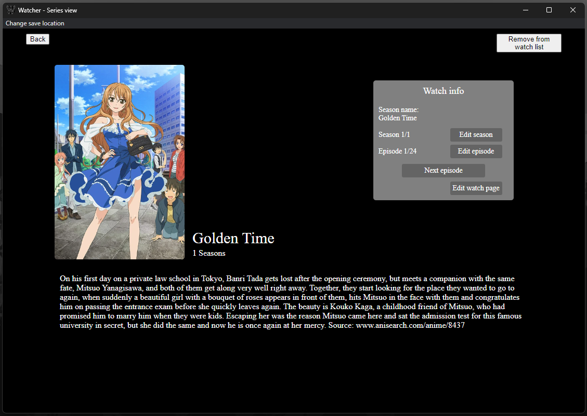

# Watcher
This is a little tool to keep track of your shows progress.
For now it's only supporting **anime** shows!

It also exist an [android app](https://github.com/vizualjack/WatcherApp).
Keep in mind that the app **only** provides setting your show's progress.

 

## Features
- Set show progress to next / previous episode
- Remove existing/watching shows
- Search and add new shows (it's using https://www.anisearch.de/)

## Setup
### 1. Download the app
Please take a look at the release tab here in the repository.
### 2. Install the app(.apk)
You have to allow installing apps from unknown sources via settings.
### 3. Use it!

# Development information
This project is a NodeJS project so the normal routine should take place here.

#### For project setup
`npm install` - getting project's dependencies

#### Normal routine 
`npm run start` - starts the app for testing
`npm run package` - creates all files u need to use the app
`npm run make` - creates a setup executable for simpler sharing the app with others
